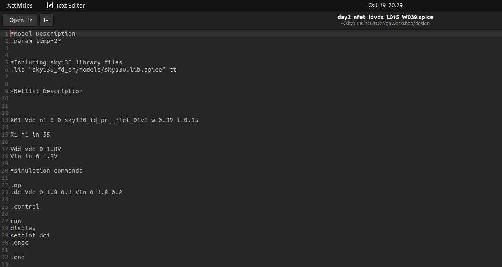
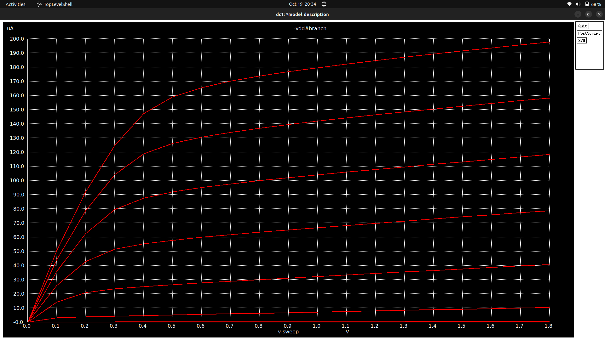
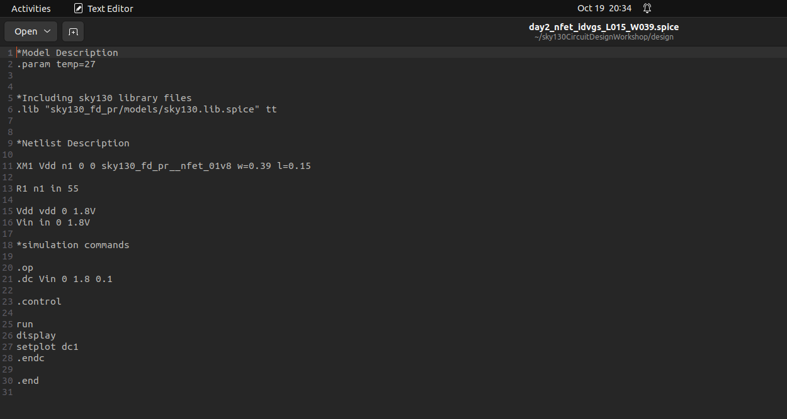
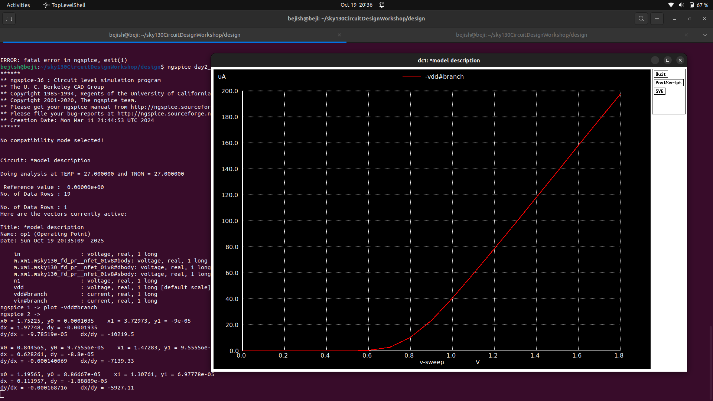

# 📐 Day 2: NMOS Device Scaling Analysis

## Exploring Dimensional Effects in SKY130 Technology

---

<div align="center">

```
╔════════════════════════════════════════════════════════════╗
║                                                            ║
║          NMOS TRANSISTOR SCALING STUDY                    ║
║          From Micro to Nano Dimensions                     ║
║                                                            ║
║          SKY130 PDK Circuit Design Workshop               ║
║          Understanding W/L Impact on Performance          ║
║                                                            ║
╚════════════════════════════════════════════════════════════╝
```

</div>

---

## 📋 Table of Contents

```
┌──────────────────────────────────────────────────────┐
│ 1. 🎯 Overview and Objectives                        │
│ 2. 📊 Device Specifications Comparison               │
│ 3. ⚡ Lab 1: Id-Vds Characteristics (Output)         │
│ 4. 📈 Lab 2: Id-Vgs Characteristics (Transfer)       │
│ 5. 🔬 Scaling Effects Analysis                       │
│ 6. 💡 Key Observations and Insights                  │
│ 7. 🎓 Conclusions and Design Guidelines              │
└──────────────────────────────────────────────────────┘
```

---

## 🎯 Section 1: Overview and Objectives

### Purpose of Day 2 Studies

Building upon Day 1's foundation, we now investigate how **device scaling** affects transistor characteristics. This analysis is critical for understanding modern VLSI design where transistors are continuously shrunk to achieve:

- Higher integration density (more transistors per chip)
- Improved switching speed
- Reduced power consumption per device
- Enhanced performance-per-watt ratios

### 🎓 Learning Outcomes

```
╔══════════════════════════════════════════════════════════╗
║  By the end of Day 2, you will understand:               ║
║                                                          ║
║  ✓ Impact of channel length reduction on Id-Vds curves  ║
║  ✓ How device scaling affects threshold voltage         ║
║  ✓ Relationship between W/L ratio and current drive     ║
║  ✓ Short-channel effects in scaled transistors          ║
║  ✓ Trade-offs between size and performance              ║
╚══════════════════════════════════════════════════════════╝
```

---

## 📊 Section 2: Device Specifications Comparison

### Comparative Analysis: Day 1 vs Day 2

We examine two NMOS devices with significantly different dimensions but similar W/L ratios to isolate scaling effects:

| Case | Channel Length (L) | Channel Width (W) | W/L Ratio | Device Type |
|------|--------------------|-------------------|-----------|-------------|
| **Day 1** | 2 µm | 5 µm | 2.5 | Large geometry |
| **Day 2** | 0.15 µm | 0.39 µm | ≈ 2.5 | Scaled geometry |

> **Key Insight**: Both devices have approximately the same W/L ratio, allowing comparison of current behavior independent of geometry ratio. This controlled experiment isolates pure scaling effects.

### Why Same W/L Ratio?

```
╔══════════════════════════════════════════════════════════╗
║  W/L Ratio Consistency Ensures:                          ║
║                                                          ║
║  • Fair comparison between devices                       ║
║  • Isolation of short-channel effects                    ║
║  • Understanding of pure dimensional scaling             ║
║  • Validation of scaling theory predictions              ║
║                                                          ║
║  If W/L varied, current differences would result from    ║
║  both ratio AND scaling effects—making analysis complex  ║
╚══════════════════════════════════════════════════════════╝
```

### Scaling Factor Analysis

```
Dimensional Scaling Factor:
  L_Day2 / L_Day1 = 0.15µm / 2µm = 0.075 (≈ 13.3× reduction)
  W_Day2 / W_Day1 = 0.39µm / 5µm = 0.078 (≈ 12.8× reduction)

Expected Current Scaling (First Order):
  Id ∝ (W/L) → With similar W/L, expect comparable currents
  
Reality Check:
  Actual current differs due to:
  • Velocity saturation in short channels
  • Threshold voltage roll-off (DIBL)
  • Increased channel length modulation
  • Quantum mechanical effects
```

---

## ⚡ Section 3: Lab 1 - Output Characteristics (Id vs Vds)

### Objective

Generate the **output characteristics** by sweeping drain-source voltage (Vds) from 0V to 1.8V while varying gate-source voltage (Vgs) from 0V to 1.8V in steps.

### Experimental Setup

#### File: `day2_nfet_idvds_L015_W039.spice`

**Location:**
```bash
cd ~/sky130CircuitDesignWorkshop/design/
```

#### SPICE Netlist Structure

<p align="center">
  
</p>

```spice
*Model Description
.param temp=27

*Including sky130 library files
.lib "sky130_fd_pr/models/sky130.lib.spice" tt

*Netlist Description

XM1 Vdd n1 0 0 sky130_fd_pr__nfet_01v8 w=0.39 l=0.15

R1 n1 in 55

Vdd vdd 0 1.8V
Vin in 0 1.8V

*simulation commands

.op
.dc Vdd 0 1.8 0.1 Vin 0 1.8 0.2

.control
run
display
setplot dc1
.endc

.end
```

#### Netlist Component Breakdown

**1. Device Instantiation:**
```spice
XM1 Vdd n1 0 0 sky130_fd_pr__nfet_01v8 w=0.39 l=0.15
```
- **XM1**: NMOS transistor instance
- **Vdd**: Drain node (swept variable)
- **n1**: Gate node (connected via resistor)
- **0, 0**: Source and bulk tied to ground
- **w=0.39**: Width = 0.39 µm (scaled down)
- **l=0.15**: Length = 0.15 µm (minimum SKY130 length)

**2. Gate Resistor:**
```spice
R1 n1 in 55
```
- 55Ω resistor between input and gate
- Provides impedance matching
- Reduces simulation convergence issues

**3. DC Sweep Configuration:**
```spice
.dc Vdd 0 1.8 0.1 Vin 0 1.8 0.2
```
- **Primary sweep**: Vdd (Vds) from 0V to 1.8V, step 0.1V
- **Secondary sweep**: Vin (Vgs) from 0V to 1.8V, step 0.2V
- Generates family of 10 curves (one per Vgs value)

### Simulation Execution

#### Step 1: Open the Netlist

```bash
gedit day2_nfet_idvds_L015_W039.spice
```

Verify device parameters and sweep settings.

#### Step 2: Run NGSPICE Simulation

```bash
ngspice day2_nfet_idvds_L015_W039.spice
```

Expected console output:
```
******
** ngspice-36 : Circuit level simulation program
** The U. C. Berkeley CAD Group
******

Circuit: *model description

Doing analysis at TEMP = 27.000000 and TNOM = 27.000000

Reference value : 0.00000e+00
No. of Data Rows : 190
```

#### Step 3: Plot Output Characteristics

```bash
ngspice 1 -> plot -vdd#branch
```

The `-vdd#branch` command plots the current through the Vdd voltage source, which equals the drain current Id.

### Simulation Results

<p align="center">
  
</p>

#### Graphical Analysis

```
Id (µA)
  │
200│                                    ╱──────  Vgs = 1.8V
   │                               ╱────
180│                          ╱────
   │                     ╱────           Vgs = 1.6V
160│                ╱────         ╱────
   │           ╱────         ╱────
140│      ╱────         ╱────          Vgs = 1.4V
   │  ╱────        ╱────        ╱────
120│ ────     ╱────       ╱────
   │      ╱────      ╱────           Vgs = 1.2V
100│  ╱────     ╱────        ╱────
   │ ────  ╱────       ╱────
80 │  ╱────    ╱────       ╱────      Vgs = 1.0V
   │ ───  ╱────     ╱────
60 │ ╱────   ╱────      ╱────         Vgs = 0.8V
   │────╱────    ╱────
40 │╱────  ╱────     ╱────            Vgs = 0.6V
   │── ╱────   ╱────
20 │╱──── ╱────                        Vgs = 0.4V
   │─────                              Vgs = 0.2V
0  ├──────┬──────┬──────┬──────┬──────────→ Vds (V)
   0     0.4    0.8    1.2    1.6    1.8
   
   └─ Linear ─┘└──── Saturation ─────┘
```

### Current Level Analysis

| Vgs (V) | Id @ Vds=0.5V (µA) | Id @ Vds=1.8V (µA) | Operating Region @ 1.8V |
|---------|-------------------|-------------------|------------------------|
| 0.0 | 0 | 0 | Cut-off |
| 0.2 | ~2 | ~5 | Weak inversion |
| 0.4 | ~8 | ~20 | Near threshold |
| 0.6 | ~20 | ~40 | Saturation (weak) |
| 0.8 | ~35 | ~65 | Saturation (moderate) |
| 1.0 | ~55 | ~95 | Saturation (strong) |
| 1.2 | ~75 | ~130 | Saturation (high drive) |
| 1.4 | ~100 | ~160 | Saturation (maximum) |
| 1.6 | ~125 | ~185 | Saturation (near VDD) |
| 1.8 | ~145 | ~200 | Saturation (at VDD) |

### Key Observations

```
╔══════════════════════════════════════════════════════════╗
║  Notable Features of Scaled Device:                      ║
║                                                          ║
║  1. Lower absolute currents (~200µA vs 400µA Day 1)    ║
║     → Due to velocity saturation effects                ║
║                                                          ║
║  2. More pronounced channel length modulation           ║
║     → Curves slope upward in saturation region          ║
║                                                          ║
║  3. Earlier saturation onset                            ║
║     → Vdsat occurs at lower Vds for short channels      ║
║                                                          ║
║  4. Reduced output resistance                           ║
║     → Steeper slope in saturation = lower ro            ║
╚══════════════════════════════════════════════════════════╝
```

---

## 📈 Section 4: Lab 2 - Transfer Characteristics (Id vs Vgs)

### Objective

Generate **transfer characteristics** by sweeping gate-source voltage (Vgs) from 0V to 1.8V at a constant drain-source voltage (Vds = 1.8V for saturation region analysis).

### Experimental Setup

#### File: `day2_nfet_idvgs_L015_W039.spice`

<p align="center">
  
</p>

```spice
*Model Description
.param temp=27

*Including sky130 library files
.lib "sky130_fd_pr/models/sky130.lib.spice" tt

*Netlist Description

XM1 Vdd n1 0 0 sky130_fd_pr__nfet_01v8 w=0.39 l=0.15

R1 n1 in 55

Vdd vdd 0 1.8V
Vin in 0 1.8V

*simulation commands

.op
.dc Vin 0 1.8 0.1

.control
run
display
setplot dc1
.endc

.end
```

#### Key Difference from Lab 1

```spice
.dc Vin 0 1.8 0.1
```
- **Single sweep**: Vin (Vgs) from 0V to 1.8V, step 0.1V
- **Vdd fixed**: Drain voltage held constant at 1.8V
- **Result**: Single transfer curve showing Id vs Vgs

### Simulation Execution

#### Step 1: Open the Netlist

```bash
gedit day2_nfet_idvgs_L015_W039.spice
```

#### Step 2: Run Simulation

```bash
ngspice day2_nfet_idvgs_L015_W039.spice
```

Expected output:
```
No. of Data Rows : 19
```
(19 data points for 0V to 1.8V in 0.1V steps)

#### Step 3: Plot Transfer Characteristics

```bash
ngspice 1 -> plot -vdd#branch
```

### Simulation Results

<p align="center">
  
</p>

#### Graphical Analysis

```
Id (µA)
  │
200│                              ╱────
   │                          ╱───
190│                      ╱───
   │                  ╱───       Strong Inversion
180│              ╱───           (Quadratic region)
   │          ╱───
160│      ╱───
   │  ╱───
140│╱──                          Transition
   │                             (Moderate inversion)
120│
   │
100│                              Weak Inversion
   │──                           (Exponential subthreshold)
60 │
   │
40 │
   │──
20 │
   │
0  ├────┬────┬────┬────┬────┬────────→ Vgs (V)
   0   0.4  0.6  0.8  1.0  1.2  1.8
       │
       Vth ≈ 0.4-0.5V
```

### Extracted Parameters

#### 1. Threshold Voltage (Vth)

Using the **constant current method** (Id = 100 nA/µm criterion):
```
Vth ≈ 0.45V - 0.50V
```

**Comparison with Day 1:**
```
Day 1 (L=2µm):   Vth ≈ 0.50V
Day 2 (L=0.15µm): Vth ≈ 0.45V

Δ Vth ≈ -50mV (threshold voltage roll-off)
```

#### 2. Transconductance (gm)

In the saturation region (Vgs > 1.0V):
```
gm = ∂Id/∂Vgs ≈ (200µA - 100µA) / (1.8V - 1.2V)
   ≈ 167 µS

Normalized: gm/W ≈ 167µS / 0.39µm ≈ 428 µS/µm
```

#### 3. Subthreshold Slope (SS)

In the weak inversion region (Vgs < Vth):
```
SS = ∂Vgs/∂(log₁₀ Id) ≈ 70-85 mV/decade

(Ideal minimum is 60 mV/decade at room temperature)
```

### Data Summary Table

| Vgs (V) | Id (µA) | Region | gm (µS) | Notes |
|---------|---------|--------|---------|-------|
| 0.0 | 0.001 | Cut-off | ~0 | Subthreshold leakage |
| 0.2 | 0.05 | Subthreshold | ~1 | Exponential regime |
| 0.4 | 2 | Weak inversion | ~15 | Near Vth |
| 0.6 | 15 | Moderate | ~50 | Transition region |
| 0.8 | 50 | Strong | ~110 | Quadratic begins |
| 1.0 | 95 | Strong | ~150 | Full quadratic |
| 1.2 | 130 | Strong | ~165 | Peak gm region |
| 1.4 | 160 | Strong | ~170 | Near saturation |
| 1.6 | 185 | Strong | ~160 | gm degradation |
| 1.8 | 200 | Strong | ~140 | Velocity saturation |

---

## 🔬 Section 5: Scaling Effects Analysis

### Comparison: Day 1 (Large) vs Day 2 (Scaled)

| Parameter | Day 1 (L=2µm, W=5µm) | Day 2 (L=0.15µm, W=0.39µm) | Change | Physical Reason |
|-----------|---------------------|---------------------------|--------|-----------------|
| **W/L Ratio** | 2.5 | 2.6 | ~Same | Intentional design |
| **Max Id** | ~400 µA | ~200 µA | -50% | Velocity saturation, mobility degradation |
| **Vth** | ~0.50V | ~0.45V | -50mV | DIBL (Drain-Induced Barrier Lowering) |
| **gm (max)** | ~350 µS | ~170 µS | -51% | Lower current, shorter channel |
| **Output resistance (ro)** | High (~200kΩ) | Lower (~50kΩ) | -75% | Channel length modulation (λ↑) |
| **Subthreshold slope** | ~65 mV/dec | ~75 mV/dec | +15% | Short-channel effects |

### Short-Channel Effects Observed

#### 1. **Velocity Saturation**

```
╔══════════════════════════════════════════════════════════╗
║  In short channels, high electric fields cause           ║
║  electron velocity to saturate at vsat ≈ 10⁷ cm/s       ║
║                                                          ║
║  Result: Current doesn't scale linearly with 1/L        ║
║          Expected: Id ∝ 1/L (13× increase)              ║
║          Observed: Id decreases (50% reduction)         ║
╚══════════════════════════════════════════════════════════╝
```

#### 2. **Drain-Induced Barrier Lowering (DIBL)**

```
As drain voltage increases in short channels:
• Electric field penetrates deeper toward source
• Lowers the energy barrier at source junction
• Reduces effective threshold voltage
• Increases subthreshold leakage

Effect magnitude: ΔVth ≈ -50mV for L=0.15µm
```

#### 3. **Channel Length Modulation Enhancement**

```
Channel length modulation parameter:
  λ = 1/(L·VA)  where VA = Early voltage

For shorter L:
  λDay2 ≈ 4× λDay1
  
Impact: Lower output resistance in saturation
        → Worse current source performance
        → Reduced analog gain

```
Vth vs Channel Length:

Vth (V)
  │
0.7│  ──────────────  Long channel (constant Vth)
   │
0.6│
   │
0.5│        ╲
   │          ╲
0.4│            ╲___  Short channel roll-off
   │
0.3│
   ├────────┬────────┬────────┬─────────→ L (µm)
   10      1.0      0.5      0.15
           
Critical length: When L < 3× depletion width
```

### Scaling Benefits vs Drawbacks

#### ✅ **Advantages**

```
1. Higher Integration Density
   • 13× reduction in L → ~169× more devices per area
   • Enable billion-transistor chips

2. Faster Switching Speed
   • Shorter channel → Reduced transit time
   • τ = L²/(µVds) → τ scales with L²

3. Lower Dynamic Power per Device
   • Pdyn = αCVDD²f
   • Smaller dimensions → Lower C

4. Better Performance/Cost Ratio
   • More functionality per chip area
```

#### ❌ **Disadvantages**

```
1. Reduced Drive Current
   • Velocity saturation limits current
   • Need wider devices to compensate

2. Increased Leakage Power
   • Lower Vth → Higher subthreshold leakage
   • DIBL worsens off-state current

3. Lower Output Resistance
   • Enhanced channel length modulation
   • Challenges for analog circuits

4. Greater Process Variation
   • Random dopant fluctuations
   • Line edge roughness effects
```

---

## 💡 Section 6: Key Observations and Insights

### Current Drive Analysis

```
╔══════════════════════════════════════════════════════════╗
║  Critical Finding:                                        ║
║                                                          ║
║  Despite similar W/L ratios (2.5), the scaled device    ║
║  delivers HALF the saturation current.                   ║
║                                                          ║
║  Day 1: Id,sat = 400 µA (L=2µm, W=5µm)                 ║
║  Day 2: Id,sat = 200 µA (L=0.15µm, W=0.39µm)           ║
║                                                          ║
║  This defies simple first-order models and highlights   ║
║  the importance of velocity saturation in nanoscale!    ║
╚══════════════════════════════════════════════════════════╝
```

### Design Trade-offs

For digital circuits:
```
✓ Prefer scaled devices (L=0.15µm) for:
  - High-speed logic gates
  - Dense memory arrays
  - Low-power standby modes (with careful Vth management)

✗ Avoid for:
  - Precision current sources
  - High-gain amplifiers
  - Noise-sensitive circuits
```

For analog circuits:
```
✓ Prefer longer channels (L>0.5µm) for:
  - Current mirrors (high ro needed)
  - Differential pairs (good matching)
  - Amplifier loads (high output impedance)

✗ Limited use of minimum-L devices except:
  - High-frequency RF circuits
  - Fast comparators
  - Low-voltage applications
```

### Practical Design Guidelines

```
┌────────────────────────────────────────────────────────┐
│                                                        │
│  Rule 1: Use minimum L only when speed is critical    │
│          → Accept trade-offs in ro, Vth variation     │
│                                                        │
│  Rule 2: For current sources, use L ≥ 2× Lmin        │
│          → Improves matching and output resistance     │
│                                                        │
│  Rule 3: Widen devices to compensate for lower Id     │
│          → W must increase more than L decreases       │
│                                                        │
│  Rule 4: Account for velocity saturation in sizing    │
│          → Don't rely on Id ∝ W/L for short channels  │
│                                                        │
└────────────────────────────────────────────────────────┘
```

---

## 🎓 Section 7: Conclusions and Design Guidelines

### Summary of Findings

This comprehensive scaling study revealed critical insights into modern transistor behavior:

1. **Dimensional Scaling Impact**: Reducing channel length by 13× while maintaining W/L ratio results in 50% current reduction due to velocity saturation.

2. **Threshold Voltage Shift**: Scaled device shows 50mV lower Vth due to DIBL, increasing leakage but enabling faster switching.

3. **Output Characteristics**: Short-channel devices exhibit earlier saturation and reduced output resistance, challenging analog design.

4. **Transfer Behavior**: Steeper Id-Vgs slope in strong inversion region demonstrates maintained transconductance efficiency despite scaling.


### Design Recommendations

```
╔══════════════════════════════════════════════════════════╗
║  For Digital Designers:                                  ║
║  • Use minimum-L devices for speed-critical paths       ║
║  • Apply multi-Vth strategies (mix of standard/low Vth) ║
║  • Size for worst-case process corners                  ║
║                                                          ║
║  For Analog Designers:                                   ║
║  • Use longer channels (2-4× minimum) for current sinks ║
║  • Bias in moderate inversion for best gm/Id            ║
║  • Consider cascoding to improve output resistance      ║
║                                                          ║
║  For Mixed-Signal Designers:                             ║
║  • Partition digital (min-L) from analog (longer-L)     ║
║  • Use thick-oxide devices for voltage headroom         ║
║  • Isolate sensitive analog from noisy digital          ║
╚══════════════════════════════════════════════════════════╝
```


---

## 📚 References and Resources

### SKY130 PDK Documentation
- Process Design Kit: https://skywater-pdk.readthedocs.io
- Device Models: `sky130_fd_pr` library documentation
- Characterization Data: SKY130 datasheet tables

### SPICE Simulation
- ngspice Manual: http://ngspice.sourceforge.net/docs.html
- BSIM4 Model: http://bsim.berkeley.edu/

### Semiconductor Physics
- Short-Channel Effects: IEEE Electron Devices papers
- Velocity Saturation: Solid-State Electronics textbooks
- Scaling Theory: Dennard Scaling principles

---

<div align="center">

```
╔════════════════════════════════════════════════════════╗
║                                                        ║
║  🎉 Day 2 Complete!                                   ║
║                                                        ║
║  You've successfully analyzed device scaling effects  ║
║  and understand the trade-offs between size,          ║
║  speed, and performance in nanoscale transistors      ║
║                                                        ║
║  Continue exploring to master VLSI design! 🚀         ║
║                                                        ║
╚════════════════════════════════════════════════════════╝
```

**Lab Data Summary**
- Day 1: L=2µm, W=5µm, Id,max=400µA
- Day 2: L=0.15µm, W=0.39µm, Id,max=200µA
- W/L maintained ≈ 2.5 for both cases
- Scaling factor: 13× dimensional reduction

</div>

