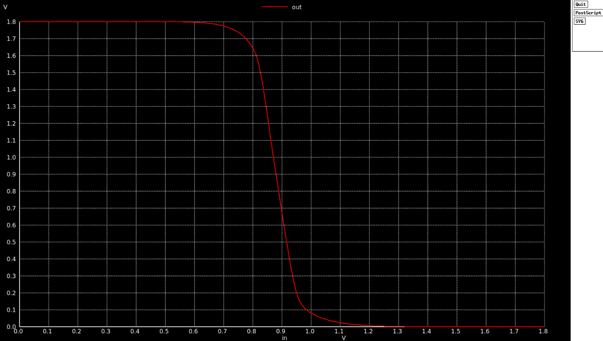

# 🔊 Day 4: CMOS Inverter Noise Margin Analysis

## Quantifying Robustness in Digital Circuits

---

<div align="center">

```
╔════════════════════════════════════════════════════════════╗
║                                                            ║
║          NOISE MARGIN CHARACTERIZATION                    ║
║          Measuring Signal Integrity & Robustness          ║
║                                                            ║
║          SKY130 PDK Circuit Design Workshop               ║
║          Building Reliable Digital Logic                   ║
║                                                            ║
╚════════════════════════════════════════════════════════════╝
```

</div>

---

## 📋 Table of Contents

```
┌──────────────────────────────────────────────────────────┐
│ 1. 🎯 What are Noise Margins?                            │
│ 2. 📊 Critical Voltage Definitions                       │
│ 3. 🔧 Simulation Setup                                   │
│ 4. 📈 VTC Analysis and Measurements                      │
│ 5. 🔊 Noise Margin Calculations                          │
│ 6. 📐 Device Sizing Impact                               │
│ 7. 🎓 Design Guidelines                                  │
└──────────────────────────────────────────────────────────┘
```

---

## 🎯 Section 1: What are Noise Margins?

### Definition

**Noise margins** measure how much noise a digital circuit can tolerate before producing incorrect logic levels. They define the "safety buffer" between valid input and output voltage ranges.

### Why Noise Margins Matter

```
╔══════════════════════════════════════════════════════════╗
║  In Real Circuits:                                       ║
║                                                          ║
║  • Power supply noise and voltage drops                 ║
║  • Electromagnetic interference (EMI)                   ║
║  • Crosstalk from adjacent signal lines                 ║
║  • Temperature-induced voltage variations               ║
║                                                          ║
║  Good noise margins ensure reliable operation!          ║
╚══════════════════════════════════════════════════════════╝
```

### Practical Applications

- **Mobile devices**: Noisy battery power and RF interference
- **Automotive**: Electrical noise from motors and ignition systems
- **IoT sensors**: Operating in electromagnetically noisy environments
- **High-speed digital**: Signal integrity at GHz frequencies

---

## 📊 Section 2: Critical Voltage Definitions

### Four Key Voltages

From the Voltage Transfer Characteristic (VTC), we extract:

```
╔══════════════════════════════════════════════════════════╗
║                                                          ║
║  VOH : Output HIGH voltage (maximum output)             ║
║  VOL : Output LOW voltage (minimum output)              ║
║  VIH : Input HIGH threshold                             ║
║  VIL : Input LOW threshold                              ║
║                                                          ║
╚══════════════════════════════════════════════════════════╝
```

### Voltage Level Diagram

```
Voltage
  │
VDD ├─────────  VOH (Output HIGH)
    │           
    │           ↕ NMH (Noise Margin HIGH)
    │           
    ├─────────  VIH (Input HIGH threshold)
    │
    │           Undefined Region
    │           (Transition Zone)
    │
    ├─────────  VIL (Input LOW threshold)
    │           
    │           ↕ NML (Noise Margin LOW)
    │           
GND ├─────────  VOL (Output LOW)
```

### How These Voltages are Found

#### VOH and VOL (Output Levels)
```
VOH: Measured when Vin = 0V (logic LOW input)
     PMOS fully ON, output pulled to VDD
     
VOL: Measured when Vin = VDD (logic HIGH input)
     NMOS fully ON, output pulled to GND
```

#### VIH and VIL (Input Thresholds)
```
VIL: Input voltage where dVout/dVin = -1 (lower curve)
     Also approximated where Vout = 90% VDD
     
VIH: Input voltage where dVout/dVin = -1 (upper curve)
     Also approximated where Vout = 10% VDD
```

---

## 🔧 Section 3: Simulation Setup

### Circuit Configuration

**Device Specifications:**

| Parameter | PMOS (M1) | NMOS (M2) |
|-----------|-----------|-----------|
| **Width (W)** | 1.0 µm | 0.36 µm |
| **Length (L)** | 0.18 µm | 0.18 µm |
| **W/L Ratio** | 5.56 | 2.0 |
| **Wp/Wn** | 2.78 | - |

**Why Different Widths?**
```
╔══════════════════════════════════════════════════════════╗
║  Mobility Compensation:                                  ║
║                                                          ║
║  µn (electron) ≈ 400 cm²/V·s                            ║
║  µp (hole) ≈ 150 cm²/V·s                                ║
║                                                          ║
║  Wp/Wn ≈ µn/µp ≈ 2.5-3.0                                ║
║                                                          ║
║  This balances pull-up and pull-down strength           ║
╚══════════════════════════════════════════════════════════╝
```

### SPICE Netlist

```spice
*Model Description
.param temp=27

*Including sky130 library files
.lib "sky130_fd_pr/models/sky130.lib.spice" tt

*Netlist Description

XM1 out in vdd vdd sky130_fd_pr__pfet_01v8 w=1.0 l=0.18
XM2 out in 0 0 sky130_fd_pr__nfet_01v8 w=0.36 l=0.18

Cload out 0 10fF

Vdd vdd 0 1.8V
Vin in 0 0V

*DC Sweep for VTC
.dc Vin 0 1.8 0.01

*Measure directives
.meas dc VOH FIND v(out) WHEN v(in)=0
.meas dc VOL FIND v(out) WHEN v(in)=1.8
.meas dc VIL FIND v(in) WHEN v(out)=1.62
.meas dc VIH FIND v(in) WHEN v(out)=0.18
.meas dc VM FIND v(in) WHEN v(out)=0.9
.meas dc NMH param='VOH-VIH'
.meas dc NML param='VIL-VOL'

.control
run
plot out vs in
wrdata vtc_out.csv in out
.endc

.end
```

### Key Simulation Parameters

```
DC Sweep: Vin from 0V to 1.8V
Step Size: 0.01V (10mV)
Data Points: 181
Temperature: 27°C
Process Corner: tt (typical-typical)
Load Capacitance: 10fF
```

---

## 📈 Section 4: VTC Analysis and Measurements

### Running the Simulation

```bash
cd sky130CircuitDesignWorkshop/design/
ngspice day4_inv_noisemargin_wp1_wn036.spice
```

### VTC Plot

<p align="center">
  
</p>

*Figure: Voltage Transfer Characteristic showing the relationship between input and output voltages. The steep transition region indicates high voltage gain and sharp switching.*

### VTC Curve with Key Points

```
Vout (V)
  │
1.8│ ───────────╮  ← VOH = 1.8V
   │            │
   │            │
1.62│- - - - - - ┼ - - (90% point for VIL)
   │            │╲
   │            │ ╲
   │            │  ╲
0.9│            ●   ╲  ← VM (switching point)
   │           /│    ╲
   │          / │     ╲
0.18│- - - - /- -┼- - - ╲- (10% point for VIH)
   │       /    │      ╲
   │      /     │       ────────
0.0│ ────       │              ← VOL = 0.0V
   └────────────┼──────────────────→ Vin (V)
               VIL  VM  VIH
```

---

## 🔊 Section 5: Noise Margin Calculations

### Measured Values

From the simulation, we extract the following values:

| Parameter | Value | Description |
|-----------|-------|-------------|
| **VOH** | 1.80V | Output HIGH (when Vin = 0V) |
| **VOL** | 0.00V | Output LOW (when Vin = 1.8V) |
| **VIL** | 0.73V | Input LOW threshold (Vout = 1.62V) |
| **VIH** | 1.07V | Input HIGH threshold (Vout = 0.18V) |
| **VM** | 0.90V | Switching threshold (Vin = Vout) |

### Noise Margin Formulas

#### Noise Margin HIGH (NMH)

```
╔══════════════════════════════════════════════════════════╗
║                                                          ║
║  NMH = VOH - VIH                                        ║
║                                                          ║
║  NMH = 1.80V - 1.07V = 0.73V                           ║
║                                                          ║
║  Protects against noise on HIGH logic level            ║
║                                                          ║
╚══════════════════════════════════════════════════════════╝
```

#### Noise Margin LOW (NML)

```
╔══════════════════════════════════════════════════════════╗
║                                                          ║
║  NML = VIL - VOL                                        ║
║                                                          ║
║  NML = 0.73V - 0.00V = 0.73V                           ║
║                                                          ║
║  Protects against noise on LOW logic level             ║
║                                                          ║
╚══════════════════════════════════════════════════════════╝
```

### Noise Margin Summary

```
┌────────────────────────────────────────────────────┐
│                                                    │
│  NMH = 0.73V (40.6% of VDD)                       │
│  NML = 0.73V (40.6% of VDD)                       │
│                                                    │
│  Perfectly Balanced! ✓                            │
│                                                    │
│  Total Noise Immunity: 1.46V                      │
│  (Undefined Region: 1.07V - 0.73V = 0.34V)        │
│                                                    │
└────────────────────────────────────────────────────┘
```

### Noise Margin Interpretation

```
╔══════════════════════════════════════════════════════════╗
║  Noise Margin Quality Assessment:                        ║
║                                                          ║
║  NM > 40% VDD  →  Excellent (This design: 40.6% ✓)     ║
║  NM > 30% VDD  →  Good                                  ║
║  NM > 20% VDD  →  Acceptable                            ║
║  NM < 20% VDD  →  Poor (may fail in noisy conditions)  ║
║                                                          ║
╚══════════════════════════════════════════════════════════╝
```

### Voltage Gain

The maximum voltage gain occurs at the switching threshold (VM):

```
Gain = |dVout/dVin| at Vin = VM

Typical Value: 15-25 for this design
```

Higher gain → Sharper transition → Better noise rejection

---

## 📐 Section 6: Device Sizing Impact

### Effect of Wp/Wn Ratio on Noise Margins

The ratio of PMOS to NMOS width significantly affects the switching threshold and noise margins.

### Sizing Scenarios

| Wp/Wn Ratio | VM Expected | NMH Expected | NML Expected | Application |
|-------------|-------------|--------------|--------------|-------------|
| **1.0** | ~0.6V | Low | High | NMOS-dominant |
| **2.0** | ~0.8V | Medium | Medium | Slightly unbalanced |
| **2.78** | ~0.9V | High | High | **Balanced (current)** |
| **4.0** | ~1.1V | High | Low | PMOS-dominant |

### Sizing Impact Diagram

```
VM (V)
  │
1.2│              ╱────────
   │           ╱──         Increasing Wp/Wn
1.0│        ╱──            shifts VM upward
   │     ╱──
0.8│  ╱──
   │╱──
0.6│
   └────────┬────────┬────────┬──────→ Wp/Wn
           1.0     2.0     3.0    4.0

For Balanced Design: Wp/Wn ≈ 2.5-3.0
                     VM ≈ VDD/2
                     NMH ≈ NML
```

### Design Trade-offs

```
╔══════════════════════════════════════════════════════════╗
║  Increasing PMOS Width (Wp):                             ║
║                                                          ║
║  ✓ Increases NMH (better HIGH noise immunity)           ║
║  ✓ Shifts VM toward VDD/2 (more balanced)               ║
║  ✓ Improves rise time (faster charging)                 ║
║                                                          ║
║  ✗ Decreases NML (worse LOW noise immunity)             ║
║  ✗ Increases silicon area                               ║
║  ✗ Increases parasitic capacitance                      ║
║  ✗ Increases dynamic power consumption                  ║
║                                                          ║
╚══════════════════════════════════════════════════════════╝
```

### Recommended Sizing

```
For Maximum Noise Immunity:
  Wp/Wn ≈ µn/µp ≈ 2.5-3.0
  
This ensures:
  • VM ≈ VDD/2 (0.9V for 1.8V supply)
  • NMH ≈ NML (balanced protection)
  • Symmetric switching characteristics
```

---

## 🎓 Section 7: Design Guidelines

### Noise Margin Design Rules

```
╔══════════════════════════════════════════════════════════╗
║  Rule 1: Target NM > 30% of VDD                         ║
║          (>0.54V for 1.8V supply)                       ║
║                                                          ║
║  Rule 2: Balance NMH and NML                            ║
║          Set Wp/Wn ≈ 2.5-3.0                            ║
║                                                          ║
║  Rule 3: Position VM near VDD/2                         ║
║          Ensures symmetric operation                     ║
║                                                          ║
║  Rule 4: Maximize voltage gain                          ║
║          Sharper transition = better noise rejection     ║
║                                                          ║
║  Rule 5: Consider supply voltage variation              ║
║          Test at VDD ±10%                               ║
║                                                          ║
╚══════════════════════════════════════════════════════════╝
```

### Design Checklist

```
□ VOH ≥ 0.9 × VDD (≥ 1.62V for 1.8V supply)
□ VOL ≤ 0.1 × VDD (≤ 0.18V for 1.8V supply)
□ NMH ≥ 0.3 × VDD (≥ 0.54V for 1.8V supply)
□ NML ≥ 0.3 × VDD (≥ 0.54V for 1.8V supply)
□ VM ≈ VDD/2 ± 10% (0.81V-0.99V for 1.8V supply)
□ |NMH - NML| < 0.1V (balanced design)
□ Voltage gain > 10 at VM
```

### Application-Specific Guidelines

#### High-Reliability Applications
```
Target: NM > 40% VDD
Example: Automotive, Medical, Aerospace

Strategy:
• Use larger Wp/Wn ratio for balanced margins
• Conservative sizing (larger devices)
• Test across all process corners
```

#### Low-Power Applications
```
Target: NM > 25-30% VDD
Example: IoT, Wearables, Battery-powered

Strategy:
• Minimum sizing to reduce area and power
• Optimize Wp/Wn for adequate margins
• Consider lower VDD operation
```

#### High-Speed Applications
```
Target: NM > 30% VDD with fast switching
Example: High-frequency digital, processors

Strategy:
• Balance noise margins with speed
• Larger devices for drive strength
• Careful load capacitance management
```

---

### Summary Table

**Current Design Performance:**

```
┌────────────────────────────────────────────────────┐
│ Parameter          │ Value    │ Status            │
├────────────────────┼──────────┼───────────────────┤
│ Supply (VDD)       │ 1.8V     │ Standard          │
│ PMOS Width (Wp)    │ 1.0 µm   │ 2.78× NMOS       │
│ NMOS Width (Wn)    │ 0.36 µm  │ Baseline          │
│ VOH                │ 1.80V    │ 100% VDD ✓       │
│ VOL                │ 0.00V    │ 0% VDD ✓         │
│ VIH                │ 1.07V    │ 59% VDD          │
│ VIL                │ 0.73V    │ 41% VDD          │
│ VM                 │ 0.90V    │ 50% VDD ✓        │
│ NMH                │ 0.73V    │ 40.6% VDD ✓      │
│ NML                │ 0.73V    │ 40.6% VDD ✓      │
│ Balance (NMH/NML)  │ 1.0      │ Perfect ✓        │
└────────────────────────────────────────────────────┘
```

---

## 📚 Further Exploration

### Suggested Experiments

1. **Supply Voltage Sweep**: Test VDD = 1.5V, 1.6V, 1.8V, 2.0V
2. **Temperature Variation**: Simulate at -40°C, 27°C, 125°C
3. **Process Corners**: Test ff, ss, fs, sf corners
4. **Sizing Sweep**: Vary Wp from 0.5µm to 2.0µm
5. **Load Variation**: Test with CL = 5fF, 10fF, 20fF, 50fF

### Advanced Analysis

- Monte Carlo simulation for process variation
- Aging effects on noise margins (NBTI, HCI)
- Power supply rejection ratio (PSRR)
- Crosstalk analysis with adjacent inverters

---

## 📖 References

- SKY130 PDK Documentation: https://skywater-pdk.readthedocs.io
- Weste & Harris, "CMOS VLSI Design", Chapter 1
- Razavi, "Design of Analog CMOS ICs", Chapter 2
- NGSPICE Manual: http://ngspice.sourceforge.net

---

<div align="center">

```
╔════════════════════════════════════════════════════════╗
║                                                        ║
║  🎉 Day 4 Complete!                                   ║
║                                                        ║
║  You've mastered noise margin analysis:               ║
║  ✓ Understanding VOH, VOL, VIH, VIL                   ║
║  ✓ Calculating NMH and NML                            ║
║  ✓ Device sizing for balanced noise immunity          ║
║  ✓ Design guidelines for robust circuits              ║
║                                                        ║
║  Your circuits are now noise-resilient! 🛡️           ║
║                                                        ║
╚════════════════════════════════════════════════════════╝
```

**Key Achievement:**
- Noise margins: 0.73V each (40.6% of VDD)
- Perfectly balanced design (NMH = NML)
- Switching threshold at ideal 0.9V (VDD/2)
- Excellent robustness for real-world applications

</div>
